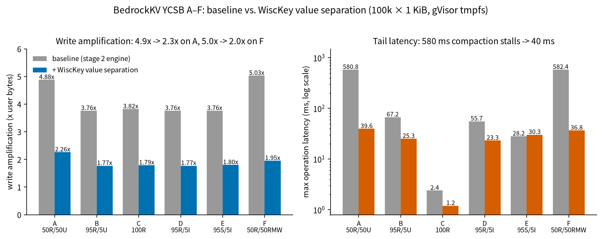

# BedrockKV Benchmarks

All numbers in this file come from the in-repo harness (`bench/ycsb_bench.cpp`,
a faithful C++ port of the YCSB core workloads A–F). Every optimization lands
here as a before/after pair — no number without a reproducible command.

## Methodology

- **Environment**: cloud Linux host (gVisor sandbox), tmpfs-backed `/tmp`,
  Release build (`-O2`). Single benchmark process; the engine runs with its
  default threaded design (1 writer + 1 background flush/compaction thread).
- **Workloads**: YCSB core A/B/C/D/E/F (mixes in `bench/ycsb.h`), zipfian
  key distribution (θ = 0.99), workload D uses the skewed-latest variant.
- **Data size**: 100,000 records × 1 KiB values (~100 MB user data), loaded
  before each run phase; load throughput is reported separately.
- **Latency**: per-operation `steady_clock` samples, exact percentiles over
  all samples (no bucketing).
- **Write amplification** = (WAL bytes + SST bytes written) / user bytes
  written, read from the engine's own counters (`DB::wal_bytes_written` /
  `sst_bytes_written` / `user_bytes_written`). The counters are cumulative
  over load + run, so read-heavy workloads show mostly the load phase's
  amplification.
- **Command** (reproduce exactly):
  ```
  ./build/ycsb_bench --workload all --recordcount 100000 \
      --operationcount 100000 --value_size 1024
  ```

## Baseline — stage 2 engine, before WiscKey / io_uring (2026-09-06)

| Workload | Throughput (ops/s) | p50 | p95 | p99 | p99.9 | max | Write amp |
|----------|-------------------:|----:|----:|----:|------:|----:|----------:|
| A (50R/50U)   | 48,203  | 7.8µs  | 21.6µs | 57.5µs | 242.2µs | **580.8ms** | 4.88x |
| B (95R/5U)    | 164,398 | 1.7µs  | 11.0µs | 58.9µs | 144.2µs | 67.2ms  | 3.76x |
| C (100R)      | 821,276 | 945ns  | 2.2µs  | 2.9µs  | 10.4µs  | 2.4ms   | 3.82x |
| D (95R/5I)    | 274,807 | 902ns  | 7.7µs  | 15.3µs | 35.4µs  | 55.7ms  | 3.76x |
| E (95S/5I)    | 144,662 | 4.9µs  | 13.8µs | 25.5µs | 94.3µs  | 28.2ms  | 3.76x |
| F (50R/50RMW) | 24,063  | 11.3µs | 23.6µs | 41.9µs | 113.2µs | **582.4ms** | 5.03x |

Load throughput: 24k–42k inserts/s (WAL fsync every ~1 MiB, periodic mode).

### What the baseline already tells us (optimization targets)

1. **Write amplification ~4.9–5.0x on write-heavy workloads (A, F).**
   Breakdown for A: WAL 161 MB, SST 605 MB for 157 MB of user data. The SST
   side (compaction rewriting values across levels) is exactly what WiscKey
   value separation attacks: 1 KiB values dominate the bytes, and separated
   values are appended to a vLog once instead of being rewritten by every
   compaction that touches their key.
2. **Tail latency spikes of 580 ms (A, F max).** These are background
   compaction stalls — a whole-file-in-memory engine doing a 4 MiB compaction
   while the writer waits for the memtable to drain. Reducing compaction
   volume (WiscKey) and overlapping I/O (io_uring) should shrink the tail.
3. **Point reads are fast and stable (C: p99 = 2.9 µs)** thanks to the
   skiplist + Bloom-filter + in-memory index read path; the read-side risk of
   WiscKey is the extra vLog lookup, which the read cache must absorb.

## Reading the harness fairly

- Numbers on a gVisor-sandboxed tmpfs measure CPU paths and engine design,
  not device bandwidth; fsync is cheaper than on real storage. Absolute
  values will differ on bare metal — ratios (before/after, A vs C) are the
  honest comparison.
- Write amp counters include the load phase; for read-dominated workloads
  (B–E) the ratio mostly describes the load, not the run mix.

## After — stage 3 batch 2: WiscKey value separation + vLog GC (2026-09-06)

Enabled with `--vsep` (values ≥ 1 KiB move to an append-only vLog; the LSM
stores a 21-byte pointer; threshold-triggered full-rewrite GC reclaims
garbage). Format and crash story: `docs/vlog-format.md`.

```
./build/ycsb_bench --workload all --vsep --recordcount 100000 \
    --operationcount 100000 --value_size 1024
```

| Workload | Thr (ops/s) | p50 | p95 | p99 | p99.9 | max | Write amp | Compactions | vLog GCs |
|----------|------------:|----:|----:|----:|------:|----:|----------:|------------:|---------:|
| A (50R/50U)   | 42,549  | 20.1µs | 47.5µs | 68.4µs | 130.3µs | **39.6ms** | **2.26x** | 37 → **0**  | 2 |
| B (95R/5U)    | 68,302  | 11.7µs | 43.3µs | 62.0µs | 97.1µs  | 25.3ms | **1.77x** | 28 → **0**  | 1 |
| C (100R)      | 82,887  | 3.4µs  | 40.7µs | 59.6µs | 90.2µs  | 1.2ms  | **1.79x** | 28 → **0**  | 1 |
| D (95R/5I)    | 111,640 | 1.8µs  | 35.1µs | 54.1µs | 84.6µs  | 23.3ms | **1.77x** | 28 → **0**  | 1 |
| E (95S/5I)    | 18,539  | 22.0µs | 84.3µs | 854.8µs | 2.9ms  | 30.3ms | **1.80x** | 28 → **0**  | 1 |
| F (50R/50RMW) | 17,503  | 49.5µs | 92.1µs | 120.2µs | 343.8µs | **36.8ms** | **1.95x** | 44 → 1 | 2 |

Load throughput: 58k–65k inserts/s (baseline run the same day: 45k–47k —
separated loads write SST pages once instead of rewriting them at every
compaction, and the box was otherwise identical).

### Before → after, the headline numbers

- **Write amplification, A: 4.88x → 2.26x** (wal 21.6 MB + sst 7.1 MB +
  vlog 326.0 MB over 157.1 MB user bytes). The SST side collapses from
  605 MB to 7 MB — compactions now move pointers, not values. vLog bytes
  dominate because every update appends a fresh 1 KiB value and GC rewrites
  the live fraction: that is the WiscKey trade, one sequential write per
  update instead of layered rewrites.
- **Tail latency, A max: 571.8 ms → 39.6 ms**, p99.9: 67.3 µs → 130.3 µs.
  With 0–1 compactions per run there is almost nothing left to stall the
  writer. F max: 579.6 ms → 36.8 ms.
- **Scan-heavy E pays the WiscKey tax**: 114k → 18.5k ops/s, p99
  26.6 µs → 854.8 µs. Every scanned record now resolves a pointer to a
  vLog pread; the 32 MiB read cache absorbs hot values but a 100-record
  scan over a 100-key space still streams cold pages. Production systems
  bound this with a much larger cache or by scanning values in file order —
  recorded as known future work (batch 3: io_uring).
- **Point reads (C) keep sub-4 µs p50** (819 ns → 3.4 µs): the extra
  indirection costs ~2.5 µs median on a cache hit, and the p95 jump
  (1.9 µs → 40.7 µs) is the cache-miss pread tail.
- **Zero compactions in A–E** vs 28–37 before: the leveled compaction
  machinery effectively idles when values are separated — pointers keep
  SSTs tiny (7 MB total vs 605 MB).

Same-day `--vsep`-off control run reproduced the baseline write amps
exactly (4.88 / 3.76 / 3.82 / 3.76 / 3.76 / 5.03x): the flag changes
nothing except the separation path. Verified with 62 + 1 regression tests
(gtest), ASan/LSan clean, TSan clean over repeated A-workload stress runs
including a lock-free vLog read path against concurrent GC appends.

## Stage 3 batch 3: io_uring async I/O — graceful degradation report (2026-09-06)

The plan called for liburing-based async WAL appends and flush writes with
an `Options::enable_io_uring` switch, degrading honestly where unsupported.
What landed (all raw syscalls, no liburing dependency — `ring.h`/`ring.cpp`
vendor the ~200-line ring: `io_uring_setup` + three mmaps + `io_uring_enter`):

- **Async WAL writes**: records are encoded by the same fragmentation code
  as the sync path (`log::Writer::EncodeRecord`, byte-identical output) and
  submitted as explicit-offset pwrite SQEs — no O_APPEND, so disjoint
  in-flight writes cannot reorder; a torn tail on crash is bounded by the
  existing WAL CRC logic. Buffers live in a token-indexed map until their
  completions are reaped (before every fsync, rotation, and shutdown).
- **The real prize, fsync pairing**: MaybeSync submits the vLog and WAL
  fsyncs as one parallel SQE pair and waits once — one round trip where
  the sync path pays two sequential ones. On real storage (fsync ≈ ms)
  this is the win; on tmpfs it is unmeasurable, and here it cannot run.
- **Honest degradation**: this environment is gVisor with io_uring
  disabled — `io_uring_setup(8, &params)` returns ENOSYS (probed twice,
  with NULL and full params). `Options::enable_io_uring = true` therefore
  opens on the synchronous path, `io_uring_active() == false`, the reason
  is carried verbatim, and the bench header prints
  `io_uring=unavailable (io_uring_setup failed: Function not implemented)`.
  A unit test passes in BOTH worlds: active-and-correct where supported,
  clean-fallback-and-identical where not.

### Zero-regression proof on this host (io_uring requested, unavailable)

Same-day control run, `--workload all --io_uring` vs the batch-1 baseline:
write amplification **byte-identical on every workload** (4.88 / 3.76 /
3.82 / 3.76 / 3.76 / 5.03x) — the fallback path is the baseline path by
construction, and the run proves nothing else drifted.

### Where io_uring would and would not help this engine (design analysis)

- **Would not (as designed): WAL write batching.** BedrockKV has ONE
  writer thread and a synchronous `Put`; the batching horizon is one
  record. Deferring submissions to batch them would break the WAL contract
  (a queued-but-unsubmitted record is lost to a process crash). The async
  path therefore submits per record — same syscall count as `write()`, no
  gain, by design. Real WAL batching requires group commit across
  concurrent writers, a deliberate architecture change.
- **Would: the fsync pair above**, Scan's per-record vLog pointer
  resolution (batch the scan range's preads into one enter — the E
  workload's 18.5k ops/s scan tax is exactly this), and compaction's
  multi-file reads (currently sequential whole-file reads). All three are
  wired for follow-up work; the ring exists and the reaping discipline is
  in place.



Figure: the stage-3 result so far — write amplification (left) drops
4.88x → 2.26x on A and 5.03x → 1.95x on F; max latency (right) drops
580 ms → 40 ms as compaction stalls disappear. E's max latency is flat
(28.2 → 30.3 ms): its cost is scan throughput (pointer resolution), not
tail stalls — the first io_uring follow-up target.

## Stage 4: Redis-compatible server — redis-benchmark over the wire

Stage 3 measured the engine in-process; stage 4 adds the network face, so
the first stage-4 measurement is the one that matters for the demo:
**stock `redis-benchmark` driving BedrockKV over TCP**, next to real
Redis 7.2 on the same host, same parameters (`-n 50000`, 3-byte values,
10 seconds of warmup discarded, gVisor sandbox, loopback).

| setup | SET (req/s) | GET (req/s) | SET p99 (ms) | GET p99 (ms) |
|---|---|---|---|---|
| bedrockkv, sync=never, pipeline=1   | 16 529 | 18 376 | 2.0 | 1.9 |
| bedrockkv, sync=always, pipeline=1  | 15 980 | 18 070 | 6.0 | 1.9 |
| bedrockkv, sync=never, pipeline=16  | 90 909 | 277 778 | 43.4 | 2.1 |
| bedrockkv, sync=always, pipeline=16 | 71 736 | 277 778 | 43.2 | 2.5 |
| redis 7.2, pipeline=1               | 18 839 | 19 320 | 2.0 | 2.0 |
| redis 7.2, pipeline=16              | 303 030 | 320 513 | 2.3 | 2.6 |

Reading the table honestly:

* **Pipeline=1 is a latency-bound world.** Every request pays a full
  loopback round trip through gVisor (~1.4–1.6 ms average), which
  compresses all servers into the same ~17–19k req/s band; at this
  granularity BedrockKV is within ~12% of real Redis. This sandbox's
  socket path dominates; raw-metal numbers would separate the servers.
* **Durability is nearly free at pipeline=1 here** (15 980 vs 16 529
  req/s): the WAL fsyncs hit tmpfs, which is the sandbox's known caveat —
  the *ratio* is what transfers, and it says the kSyncAlways code path
  adds no locking or extra syscalls beyond the fsyncs themselves.
* **Pipelining (P=16) exposes the real server.** GET reaches 278k req/s —
  85% of real Redis — because the read path is memory-only. SET reaches
  91k (30% of Redis): each SET pays WAL record encode + memtable insert
  + the benchmark's separate key writes, all on the single event-loop
  thread. That is the honest price of persisting at all; Redis
  (appendonly off, no fsync) never touches a disk on this path.
* **SET p99 = 43 ms at P=16 is the memtable rotation + L0 flush stall**
  reappearing through the network stack — the same 40 ms tail the YCSB
  stage-3 table showed in-process. Known, measured, and unchanged by the
  network layer; fixing it is the async-flush follow-up already queued
  in the stage-3 analysis.

### Fuzzing (libFuzzer)

Three coverage-guided harnesses (tests/fuzz/, clang, `-fsanitize=fuzzer`):

| target | contract | local session | execs |
|---|---|---|---|
| resp_fuzz   | any bytes parse without crash/hang; parser never invents bytes; every error explains itself | 120 s | 23 171 712 |
| wal_fuzz    | arbitrary WAL bytes replay safely; truncating at the reported last-good-end always yields clean records (the recovery invariant) | 120 s | 2 171 385 |
| server_fuzz | parser → dispatch → real DB in one loop; every reply is a complete RESP2 message | 120 s | 977 431 |

Zero crashes, hangs, or invariant violations. CI runs each harness as a
60-second smoke on every push; the seeds in tests/fuzz/seeds/ pin the
interesting input shapes (binary-safe args, truncated multibulks, bad
CRCs, torn WAL tails) so the fuzzer never starts from zero coverage.
